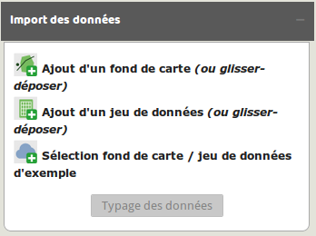

Import et manipulation des données
==================================

Deux éléments fondamentaux servent de point de départ à la réalisation d'une carte dans Magrit : le fond de carte et les données qui y sont associées.
De larges possibilités sont offertes à l'utilisateur concernant l'ajout de ces deux éléments.

<p style="text-align: center;">

</p>

## Import du fond de carte

L'import du fond de carte principal peut se faire de différentes manières :
- Par un click sur le bouton *Ajout d'un fond de carte*.
- Par un glisser-déposer dans la zone de la carte.


Plusieurs formats sont supportés:
- ```Shapefile```
- ```GeoJSON```
- ```TopoJSON```
- ```kml```
- ```gml```
- ```csv``` (contenant des colonnes x/y ou *geometry*)

> **Note:**
> La plupart des formats permettent de spécifier un système de coordonnées de référence; cette indication est ici obligatoire pour ouvrir correctement le fichier.
> Si aucun système de coordonnées de référence n'est spécifié, l'application considère qu'il s'agit de coordonnées géographiques.


## Import d'un tableau de données

L'ajout d'un tableau de données peut être effectué de plusieurs manières :
- Par un glisser-déposer du fichier dans la section appropriée du menu
- Par un clic sur le bouton *Ajout d'un jeu de données*


Plusieurs format sont pris en charge pour l'import des données :
- ```csv``` (champs séparés par une virgule ou par un point virgule)
- ```tsv``` (champs séparés par une tabulation)
- ```xls``` et ```xlsx``` (à condition que la feuille à utiliser contiennent seulement la table de données).


## Jointure des données

Lorsqu'un fond de carte et un jeu de données externes on été ajoutées, il devient possible de les joindre.
Cette opération et appelée "jointure" (c'est également le cas dans les logiciels SIG ou dans certaines bases de données) et s'effectue en choisissant les colonnes d'identifiants dans le jeu de données et dans le fond de carte.

<p style="text-align: center;">

</p>

>  Apparence de l'élément avant jointure  
>  Apparence de l'élément après jointure des champs  


## Typage des données

A chaque type de données est associé un certain nombre de modes représentation possibles. Une fois les données importées il est donc important de définir le type de chacune des variables à cartographier.

5 types de données sont possibles :
- *Stock*
- *Ratio*
- *Catégorie*
- *Inconnu* (champs non cartographiables)
- *Identifiant* (champs utilisés pour joindre les données)

<p style="text-align: center;">

</p>


## Affichage et enrichissement des tables de données

L'affichage des tableaux de données correspondant à chacune des couches ajoutées (ou obtenues en résultat d'un type de représentation) est possible via le gestionnaire de couche et le bouton représentant une table de donnée.
