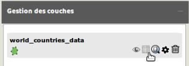
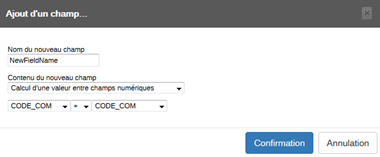

Import et manipulation des données
==================================

Deux éléments fondamentaux servent de point de départ à la réalisation d'une carte dans Magrit : le fond de carte et les données qui y sont associées.
De larges possibilités sont offertes à l'utilisateur concernant l'ajout de ces deux éléments.

<p style="text-align: center;">

</p>

## Import du fond de carte

L'import du fond de carte principal peut se faire de différentes manières :
- Par un clic sur le bouton *Ajout d'un fond de carte*.
- Par un glisser-déposer dans la zone de la carte.


Plusieurs formats sont supportés:
- ```Shapefile```
- ```GeoJSON```
- ```TopoJSON```
- ```kml```
- ```gml```
- ```csv``` (contenant des colonnes x/y)

> **Note:**
> La plupart des formats permettent de spécifier un système de coordonnées de référence; cette indication est ici obligatoire pour ouvrir correctement le fichier (présence du fichier ```.prj``` pour le format ShapeFile par exemple)
> Si aucun système de coordonnées de référence n'est spécifié, l'application considère qu'il s'agit de coordonnées géographiques.
> Les spécifications des formats [KML](http://www.gdal.org/drv_kml.html) et [GeoJSON](https://tools.ietf.org/html/rfc7946#section-4) imposent l'utilisation de coordonées géographiques (*EPSG:4326 / urn:ogc:def:crs:OGC::CRS84* )


## Import d'un tableau de données

L'ajout d'un tableau de données peut être effectué de plusieurs manières :
- Par un clic sur le bouton *Ajout d'un jeu de données*
- Par un glisser-déposer du fichier dans le menu d'import des données


Plusieurs format sont pris en charge pour l'import des données :
- ```csv``` (champs séparés par une virgule ou par un point virgule)
- ```tsv``` (champs séparés par une tabulation)
- ```xls```, ```xlsx``` et ```ods``` (à condition que la feuille à utiliser soit la première du document et contienne seulement la table de données).


## Jointure des données

Lorsqu'un fond de carte et un jeu de données externes on été ajoutées, il devient possible de les joindre.
Cette opération et appelée "jointure" (c'est également le cas dans les logiciels SIG ou dans certaines bases de données) et s'effectue en choisissant les colonnes d'identifiants dans le jeu de données et dans le fond de carte.

<p style="text-align: center;">

</p>

>  Apparence de l'élément avant jointure  
>  Apparence de l'élément après jointure des champs  


## Typage des données

A chaque type de données est associé un certain nombre de modes représentation possibles. Une fois les données importées il est donc important de définir le type de chacune des variables à cartographier.

5 types de données sont possibles :
- *Identifiant* (champs notamment utilisés pour joindre les données)
- *Stock*
- *Ratio*
- *Catégorie*
- *Inconnu* (champs non cartographiables)

### Stock
Les variables quantitatives de stock expriment des quantités concrètes et leur somme ont un sens (nombre de chômeurs, population totale, par exemple).
La représentation de ce type de phénomènes doit respecter l’expression de ces quantités et les différences de proportionnalité entre les différents éléments qui en découlent.
Exemples : Population totale en milliers d'habitants, Superficie en hectares.

### Ratios
Les variables quantitatives de taux, ou ratios, expriment un rapport entre deux quantités dont la somme n’a pas de signification. Par extension, on peut y associer les indicateurs composites numériques associant plusieurs indicateurs (indices…).
Exemples : PIB par habitant, Indicateur de développement humain.

### Catégories
Les modalités des caractères qualitatifs ne sont pas mesurables, ce sont des noms, des sigles ou des codes. On ne peut sommer des modalités qualitatives, on ne peut en calculer la moyenne.
Exemples : Noms des départements, Type d'occupation du sol.

### Identifiant
Ce champ contient des valeurs permettant d'identifier de manière unique chacune des entités de la couche de données.  
Ces sont ces champs qui sont utilisés pour effectuer une jointure de données.  
Les valeurs de ces champs sont également transférées aux entitées correspondantes dans les représentations qui le permettent (symboles proportionnels, cartogrammes, cartes choroplèthes, cartes qualitatives par à-plat de couleurs ou par utilisation de pictogrammes).
Exemple: Code INSEE de la commune, Code ISO2 d'un pays.

<p style="text-align: center;">

</p>


## Affichage et enrichissement des tables de données

L'affichage des tableaux de données correspondant à chacune des couches ajoutées (ou obtenues en résultat d'un type de représentation) est possible via le gestionnaire de couche et le bouton représentant une table de données.
<p style="text-align: center;">

</p>

Il est également possible d'enrichir la table de données par l'ajout de nouveaux champs. Les valeurs d'un nouveau champ ne peuvent pas être saisies manuellement mais seulement créées à partir de valeurs existantes.
La mise en situation suivante décrit la création successive de deux champs en utilisant des données de superficie et de population.

> Dans l'onglet "Gestion des couches" j'ouvre la table attributaire et je clique sur "ajout d'un champ":
<br> <p style="text-align:center;"> </p>
La fenêtre qui s'ouvre permet de saisir le nom du nouveau champ puis d'indiquer le type d'opération à réaliser (sur champ de type numérique ou non numérique).
<br> <p style="text-align:center;"></p>
Pour convertir des hectares en kilomètres carrés il nous faut diviser les valeurs de superficie par 100. Il existe une option "valeur constante" disponible au terme de la liste des noms de champs contenus dans la table :
<br> <p style="text-align:center;"> </p>
Une nouvelle colonne a bien été ajoutée à la table attributaire :
<br> <p style="text-align:center;"></p>
Nous pouvons ensuite calculer la densité de population en km² en créant un nouveau champ :
<br> <p style="text-align:center;">  </p>
