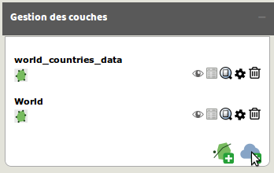
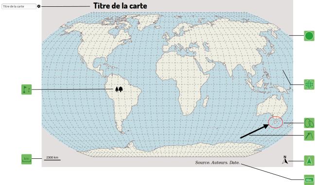

# Habillage de la carte

Magrit propose une série d'éléments nécessaires à l'habillage de la carte :

### Différentes couches géographiques permettant de contextualiser les données représentées :

- Tracé des pays du monde
- Tracé des limites administratives à différents échelons infra-nationaux (Europe, USA, Brésil)
- ...

- Graticule
- Dessin de l'emprise du globe

### Des couches géographiques d'habillage peuvent être ajoutée par l'utilisateur :

- Ces couches peuvent être ajoutées par le gestionnaire de couches
- Ces couches servent seulement à l'habillage de la carte et ne peuvent pas être utilisées avec les différents types de représentations proposées
(elles peuvent toutefois faire l'objet d'un mise en forme de base: choix d'une couleur unique de remplissage, choix d'une couleur unique de bordure, réglage de l'opacité et de l'épaisseur de la bordure)

### D'autres éléments peuvent être ajoutés, ils sont déplacables au curseur et paramétrables via un clic droit :

- Flèche d'orientation
- Échelle
- Zone de texte
- Ellipse
- Rectangle
- Flèche personnalisable
- Symbole (pictogramme ou image - les formats png, jpg et svg sont supportés)

Les légendes peuvent aussi être modifiées avec le double-clic.

Les options **"Vers le haut"** et **"Vers le bas"** des menus contextuels des éléments d'habillage permettent de gérer leur ordre d'affichage les uns par rapport aux autres ainsi que les éventuelles superpositions (de manière similaire aux fonctionnalités **"Monter"** et **"Descendre"** applicables à des objets dans *Inkscape*).
