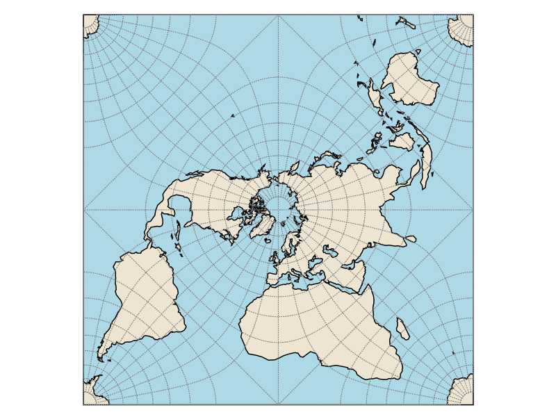

# Projections

De nombreuses projections cartographiques particulièrement adaptée à des échelles régionales ou globales sont disponibles dans l'application.   
La sélection d'une de ces projections s'effectue dans la partie supérieure de la fenêtre.

<p style="text-align: center;">

</p>

Quelques projections courantes sont proposées directement à l'utilisateur via ce menu. Ce menu permet également d'accéder à des options de personnalisation plus avancées :
- Choix d'une projection parmi les 60 proposées par l'application.
- Rotation sur les axes *lambda*, *phi* et *gamma*.

Plusieurs attributs permettent de distinguer ces projections :
- la conservation locale des surfaces (ces projections sont dites **équivalentes**, c'est par exemple le cas de la *projection azimutale équivalente de Lambert*)
- la conservation locale des angles (ces projections conservent les formes et sont dites **conformes**, c'est par exemple le cas de la *projection Mercator*)
- la représentation du globe sous une forme interrompue (*projection HEALPix* et *projection de Goode* par exemple)

<p style="text-align: center;"></p>

Selon l'échelle d'affichage de la carte et la déformation appliquée par la projection, la présence d'un figuré indiquant le nord peut ne pas s'avérer pertinente.  
Il est toutefois possible d'ajouter une couche représentant le tracé des lignes de latitude et de longitude (cette couche d'informations est ici appelé "graticule" et est disponible dans la section "ajout d'éléments d'habillage"). Cette couche d'information permet une bonne visualisation des déformations apportées par les différentes projections.
Il est également possible (et conseillé lors de l'utilisation des projections dites "interrompues") d'ajouter une couche d'informations représentant les limites du globe selon le découpage appliqué par la projection.

> #### Note:
> - La modification de la projection à utiliser est possible à tout moment.
> - Lors de la réalisation d'une carte d'une faible emprise spatiale, l'utilisation de certaines projections n'est pas pertinent.

#### Exemple d'utilisation des graticules et du fond de l'emprise du globe avec des représentations originales :
<p style="text-align: center;">
</br>
Projection Loximuthale</br></br>
</br>
Projection HEALPix</br></br>
</br>
Projection homolosine de Goode (interrompue)</br></br>
</br>
Projection quinconciale de Peirce</br></br>
</br>
Projection de Eisenlohr</br></p>


L'application propose également d'utiliser une projection et un système de coordonnées personnalisées et pouvant être obtenus en saisissant la chaîne de caractère  au format *Proj.4*[1](#) correspondante. La saisie du contenu du fichier *.prj* (au format *ESRI WKT*) est aussi possible.
L'utilisation d'une projection personnalisée de ce type n'est pas compatible avec l'ajout du fond de l'emprise du globe. Celui-ci est ainsi automatiquement désactivé lors du basculement vers une projection de ce type.
Cette fonctionnalité, qui supporte également les transformations géodésiques, permet d'utiliser la projection et le système de coordonnées les plus adaptés à la zone à cartographier selon les besoins de l'usager.
Ainsi, après avoir ajouté une couche géographique de la France, il est possible d'obtenir la projection RGF93 / Lambert-93 en saisissant la chaîne de caractère (format *Proj.4 string*)

```
+proj=lcc +lat_1=44 +lat_2=49 +lat_0=46.5 +lon_0=3 +x_0=700000
+y_0=6600000 +ellps=GRS80 +units=m +no_defs
```

ou la chaîne de caractère (format *ESRI WKT*)

```
PROJCS["RGF93_Lambert_93",GEOGCS["GCS_RGF_1993",DATUM["D_RGF_1993",SPHEROID["GRS_1980",6378137.0,298.257222101]],
PRIMEM["Greenwich",0.0],UNIT["Degree",0.017453292519943295]],
PROJECTION["Lambert_Conformal_Conic"],PARAMETER["False_Easting",700000.0],PARAMETER["False_Northing",6600000.0],PARAMETER["Central_Meridian",3.0],
PARAMETER["Standard_Parallel_1",44.0],PARAMETER["Standard_Parallel_2",49.0],PARAMETER["Latitude_Of_Origin",46.5],UNIT["Meter",1.0]]
```

Différents moyens permettent de trouver le système de coordonnées de référence adapté à la zone que l'on souhaite cartographier.
- Utilisation du service http://projest.io/ns (suggestion de projections à partir de l'emprise de la zone à cartographier).
- Utilisation d'une des projections d'emprise nationale suggérée à partir d'une [liste](./projection_list_fr.html) maintenue en parallèle de *Magrit*.
- Recherche sur le site http://epsg.io (les deux options précédentes reposent sur ces données)

De plus l'application propose automatiquement l'utilisation de la projection fournit avec le jeux de données de l'utilisateur lorsque celui-ci contient des informations sur le projection à utiliser (Shapefile, GML).
